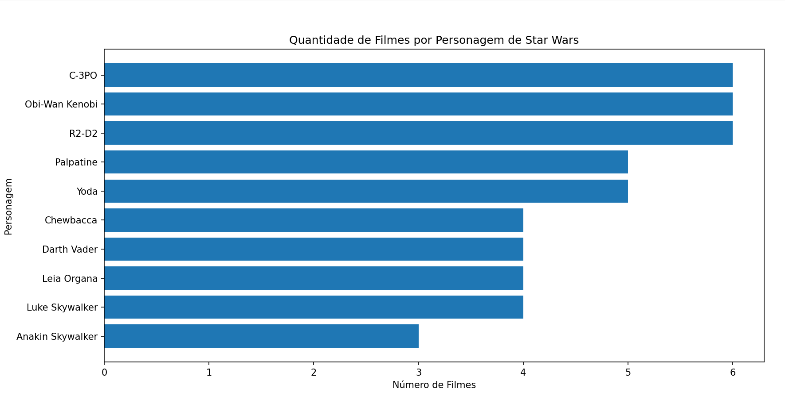
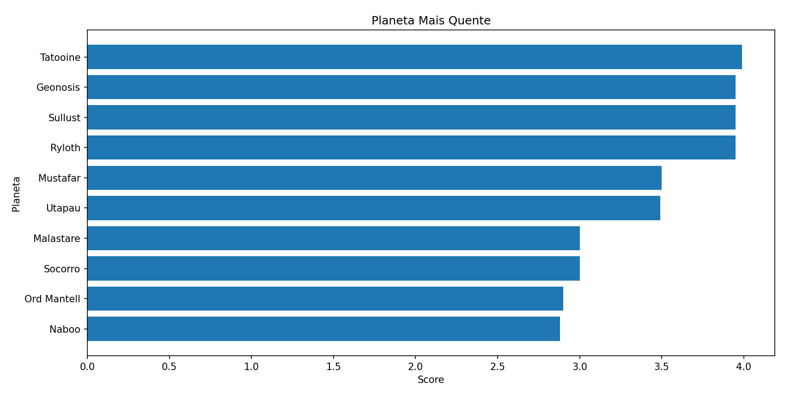
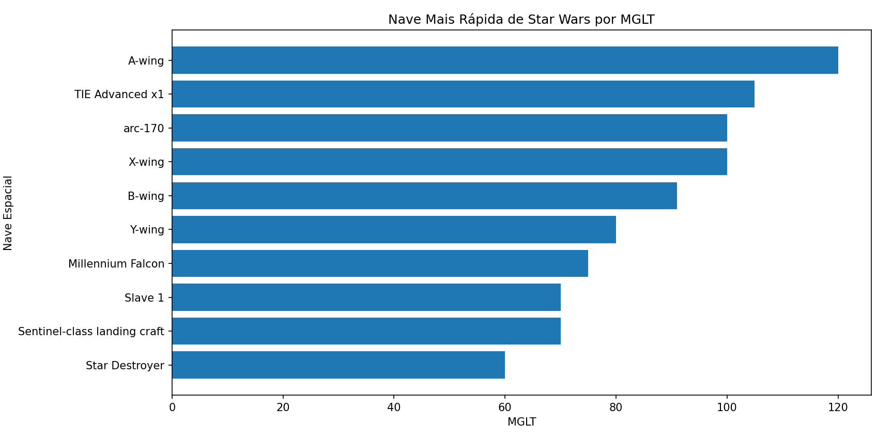

# 🚀 Análise de dados do universo Star Wars 🚀


Este projeto tem como objetivo consumir e analisar dados da API pública do Star Wars (SWAPI), realizando tarefas de engenharia de dados e análise exploratória. O foco está em identificar padrões e tendências, além de responder as seguintes perguntas:

- Qual é o personagem que apareceu em mais filmes de Star Wars?
- Quais são os planetas mais quentes do universo de Star Wars?
- Quais são as naves espaciais mais rápidas do universo de Star Wars?
- Qual é a arma mais poderosa do universo de Star Wars?

## **Tecnologias Utilizadas**

- Python
- Pandas para manipulação de dados
- Matplotlib para visualização de dados
- SQLite para armazenamento de dados
- Requests para requisições HTTP

## **Instalação e Configuração**

Para utilizar este projeto, é necessário ter Python instalado. As dependências podem ser instaladas usando o seguinte comando:

```bash
pip install pandas matplotlib requests sqlalchemy
```

## **Estrutura do Projeto**

O projeto está organizado da seguinte forma:

- **`main.py`**: Script principal que coordena o carregamento de dados, salvamento em banco de dados, análises e geração de gráficos.
- **`swapi_requests.py`**: Contém a função **`load_swapi_data`** para fazer requisições à SWAPI e carregar os dados.
- **`db_operations.py`**: Inclui funções para salvar os dados em um banco de dados SQLite e para realizar consultas.
- **`data_analysis.py`**: Contém funções para análise exploratória de dados e para gerar visualizações.

## **Como usar**

Para executar o projeto, basta rodar o script **`main.py`**. Isso irá carregar os dados da SWAPI, salvar no banco de dados SQLite, realizar análises e mostrar os resultados através de gráficos.

```bash
python main.py
```

## **Metodologia e Resultados**

### 1. Personagem que Apareceu em Mais Filmes de Star Wars

**Método:** Utiliza-se a função **`get_top_10_characters_by_movie_count`** no arquivo **`data_analysis.py`**. Esta função executa uma consulta SQL na tabela **`characters`** para contar quantas vezes cada personagem aparece nos filmes (campo **`films`**). A contagem é realizada por meio de uma junção cruzada com os elementos JSON no campo **`films`**.

**Gráfico Resultante:** Gera-se um gráfico de barras horizontais que mostra os top 10 personagens por contagem de filmes.



### 2. Planetas Mais Quentes do Universo de Star Wars

**Método:** Implementa-se a função **`get_top_10_hottest_planets`**, que calcula uma 'pontuação de calor' para cada planeta a partir da soma ponderada, com pesos de 0 a 1 definidos na função **`calculate_planet_score`** em **`data_analysis.py`,** dos fatores clima, água superficial, terreno e período orbital, conforme abaixo:

- **Pontuação do Clima (Climate Score - CS)**

| Clima | CS |
| --- | --- |
| 'arid', 'hot', 'heated’ | 1 |
| 'temperate', 'tropical’ | 0.5 |
| 'frozen', 'frigid’ | 0 |
| Outros | 0.25 |
- **Pontuação da Água Superficial (Surface Water Score - SWS)**

$$
SWS = (100 - surface water)/100
$$

- **Pontuação do Terreno (Terrain Score - TS)**

| Terreno | TS |
| --- | --- |
| 'desert', 'volcanoes', 'lava’  | 1 |
| 'barren', 'rocky’ | 0.7 |
| 'forrests', 'jungles’  | 0.3 |
| 'ice', 'snow’  | 0 |
| Outros |  0.5 |
- **Pontuação do Período Orbital (Orbital Period Score - OPS)**

| Período orbital | OPS |
| --- | --- |
| ≤ 360 | 1 |
| ≤ 500 | 0.5 |
| ≤ 1000 | 0.25 |
| > 1000 | 0.1 |
| Não numérico ou desconhecido | 0 |
- ******************************************************************Pontuação Total (Total Score)******************************************************************

$$
Total Score=CS+SWS+TS+OPS
$$

**Gráfico Resultante:** Produz-se um gráfico de barras horizontais exibindo os top 10 planetas com a maior 'pontuação de calor'.



### 3. Naves Espaciais Mais Rápidas do Universo de Star Wars

**Método:** Para determinar a nave espacial mais rápida, é importante entender a diferença entre "MGLT" e "max_atmosphering_speed", pois cada um desses atributos mede um aspecto diferente da velocidade da nave.

- **MGLT (Megalight per hour)**: Este é um indicador de velocidade no espaço, principalmente usado para medir a eficiência e a velocidade de uma nave em viagens mais longas, como as realizadas no hiperespaço. Um "Megalight" é uma unidade de distância, e MGLT refere-se à quantidade máxima de Megalights que a nave pode viajar em uma hora padrão. Logo, se você estiver interessado em qual nave é mais rápida para viagens espaciais de longa distância (como as realizadas entre sistemas estelares), então **MGLT** seria o atributo mais apropriado a ser usado.
- **Max Atmospheric Speed**: Este atributo mede a velocidade máxima da nave na atmosfera de um planeta. Portanto, se o interesse for pela velocidade dentro de uma atmosfera planetária, como em manobras de combate ou viagens curtas dentro de um sistema, então **max_atmosphering_speed** seria o atributo relevante.

Sendo assim, adotam-se duas abordagens. Primeiramente, a função **`get_top_10_fastest_starships_by_atmosphering_speed`** calcula as naves mais rápidas com base na velocidade atmosférica. Em seguida, **`get_top_10_fastest_starships_by_MGLT`** usa a velocidade MGLT. Ambas as funções filtram e ordenam os dados na tabela **`starships`**.

**Gráficos Resultantes:** Criam-se dois gráficos de barras horizontais, um para cada métrica de velocidade (velocidade atmosférica e MGLT).




**Observação:** Vale ressaltar que as naves A-wing e TIE Advanced x1 aparecem no top 10 de naves mais rápidas em ambas as categorias.

### 4. A Arma Mais Poderosa do Universo de Star Wars

- **Nota:** A análise para identificar 'a arma mais poderosa' no universo de Star Wars não é viável com os dados disponíveis na SWAPI. No endpoint **`starships`**, encontram-se referências a algumas naves famosas, como a Death Star e a Star Killer, que possuem armamentos. Entretanto, não há informações detalhadas sobre o poder de armamento ou o potencial destrutivo que permitiriam uma comparação objetiva. Além disso, a base de dados não inclui outras armas icônicas do universo, como os sabres de luz. Não foram encontradas fontes de dados alternativas que ofereçam informações suficientes para realizar tal análise. Portanto, essa questão específica permanece fora do escopo deste projeto devido à ausência de dados relevantes e comparáveis.

### **Visualizações**

As visualizações são geradas usando a função **`plot_horizontal_bar_graph`** em **`data_analysis.py`**. Esta função aceita um DataFrame do Pandas e colunas específicas para criar gráficos de barras horizontais que são exibidos para o usuário.

## **Contribuições**

Contribuições são sempre bem-vindas! Para contribuir, faça um fork do projeto, crie uma branch para sua feature ou correção de bugs, desenvolva a mudança e faça um pull request.